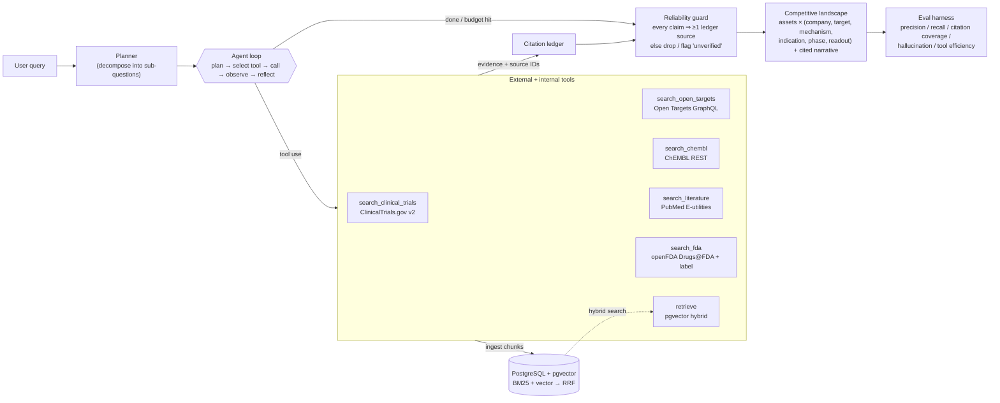

# AssetScope

**An open-source agentic competitive-intelligence engine for biopharma.**

Ask AssetScope a question like *“competitive landscape for oral GLP-1 agonists in
obesity”* and it autonomously **plans**, **calls public biomedical APIs**,
**retrieves evidence**, **self-corrects**, and assembles a **competitive
landscape table + narrative** — where every row and every sentence is
**citation-grounded**. A *reliability guard* drops any claim no retrieved source
supports: **no source, no claim.**

> ⚠️ **AssetScope is a research tool, not medical, clinical, regulatory, or
> financial advice.** See [Limitations](#limitations--honest-caveats).

[](LICENSE)

---

## Why

LLMs are fluent but hallucinate — fatal for competitive intelligence, where a
wrong phase, sponsor, or readout misleads real decisions. AssetScope is built
around one principle: **a claim only exists if a retrieved source backs it.**
Three things make that real:

1. **Tool-grounded retrieval** from the primary public sources analysts trust —
   ClinicalTrials.gov, Open Targets, ChEMBL, PubMed — each returning structured
   JSON *with source IDs/URLs*.
2. **A citation ledger** that records every piece of evidence the agent saw, and
   a **reliability guard** that verifies each claim resolves to the ledger before
   the answer is finalized.
3. **An eval harness** (the differentiator) that scores factual precision/recall
   vs a hand-curated gold set, citation coverage, hallucination rate, and tool
   efficiency — so quality is measured, not asserted.

## Architecture



The loop is intentionally **framework-light** (no LangChain/agent framework) so
the control flow stays legible — it's ~250 lines in
[assetscope/agent/loop.py](assetscope/agent/loop.py).

## The tools the agent can call

Each is a typed Python function exposed to the model as an Anthropic tool; each
returns structured JSON **with source URLs/IDs** so answers can cite.

| Tool | Source | Returns | Auth |
|---|---|---|---|
| `search_clinical_trials(query, phase?, status?)` | [ClinicalTrials.gov API v2](https://clinicaltrials.gov/data-api/api) | NCT id, title, phase, status, lead sponsor, conditions, interventions | none |
| `search_open_targets(target_or_disease)` | [Open Targets GraphQL](https://platform.opentargets.org) | target↔disease associations, tractability (Ensembl IDs) | none |
| `search_chembl(compound_or_target)` | [ChEMBL REST](https://www.ebi.ac.uk/chembl/) | molecule_chembl_id, max phase, mechanism of action, target | none |
| `search_literature(query)` | [PubMed E-utilities](https://www.ncbi.nlm.nih.gov/books/NBK25501/) | PMID, title, journal, year, abstract | optional API key |
| `search_fda(drug)` | [openFDA](https://open.fda.gov/) (Drugs@FDA + SPL label) | FDA approval status, sponsor, marketing status, NDA/BLA #, labeled indications + MoA, pharm class | optional API key |
| `retrieve(query)` | internal pgvector store | best passages from everything gathered this session | n/a |

## Quickstart (one command)

```bash
git clone <your-fork> assetscope && cd assetscope
cp .env.example .env          # add your ANTHROPIC_API_KEY for the live agent
docker compose up --build
```

Then open:

- **UI** → http://localhost:8080 (chat-style; streams plan, tool calls, guard, table)
- **API docs** → http://localhost:8000/docs
- **Health** → http://localhost:8000/health

The stack is three services: `api` (FastAPI), `db` (`pgvector/pgvector:pg16`,
schema auto-applied), and `frontend` (Vite build served by nginx). By default the
API uses the torch-free hashing embedder for instant spin-up; set
`INSTALL_EMBEDDINGS: "true"` (build arg) and `ASSETSCOPE_USE_FAKE_EMBEDDINGS=0` to
use real `sentence-transformers` embeddings.

> **No API key?** The tools, retrieval, and the **entire eval harness** run
> without one — only the *live* agent loop needs an LLM (Anthropic **or** a local model).

### Run fully locally with an open model (no API key)

AssetScope drives the **same agent loop** with any OpenAI-compatible local server
(llama.cpp `llama-server`, Ollama, vLLM) instead of the Anthropic API — for
offline / zero-cost runs. A small adapter ([`assetscope/agent/llm.py`](assetscope/agent/llm.py))
encodes the tools as a JSON-action protocol, so even modest models can run the loop.

```bash
# 1. Serve a tool-capable model (Qwen2.5-7B-Instruct Q4 is a good CPU default, ~5 GB RAM):
llama-server -m Qwen2.5-7B-Instruct-Q4_K_M.gguf -c 16384 --port 8081 --jinja
#    (or: ollama serve  &&  ollama pull qwen2.5:7b-instruct)

# 2. Point AssetScope at it and run a real query against the live public APIs:
export ASSETSCOPE_LLM_BACKEND=local
export ASSETSCOPE_LLM_BASE_URL=http://127.0.0.1:8081/v1
export ASSETSCOPE_USE_FAKE_EMBEDDINGS=1          # skip the torch download
python examples/run_local.py "competitive landscape for KRAS G12C inhibitors in NSCLC"
```

In docker-compose set the same vars, with `ASSETSCOPE_LLM_BASE_URL=http://host.docker.internal:8081/v1`.

Smaller local models trade accuracy for cost, but the **reliability guard still
enforces grounding** — it drops any claim whose citations it can't resolve, so a
weak model yields a *smaller, honest* landscape rather than a confident-but-wrong one.

> **Note on ClinicalTrials.gov:** its Akamai WAF rejects Python's TLS fingerprint
> with HTTP 403 even with browser-identical headers. AssetScope transparently falls
> back to the system `curl` binary for blocked requests (`curl` ships with
> Windows/macOS and is installed in the API Docker image).

### Run a query from the CLI / API

```bash
curl -s -X POST http://localhost:8000/query \
  -H 'Content-Type: application/json' \
  -d '{"query":"competitive landscape for KRAS G12C inhibitors in NSCLC"}' | jq .
```

## Eval scorecard (the differentiator)

Run it yourself — deterministic, no API key, no DB:

```bash
python -m assetscope.evals run            # scores the bundled replay fixtures
python -m assetscope.evals run --live      # runs the live agent (needs API key)
```

The gold set ([assetscope/evals/gold/](assetscope/evals/gold/)) spans 3
well-documented landscapes — **24 assets and ~120 hand-curated expected facts**
(company, target, mechanism, phase, latest readout per asset) plus contradiction
checks. Current scorecard from the bundled replay fixtures, written to
[results/eval_report.md](results/eval_report.md):

| Metric | Score |
|---|---|
| **Factual precision** | **100.0%** |
| **Factual recall** | **87.5%** |
| Grounded recall | 87.5% |
| Asset recall | 87.5% |
| **Citation coverage** | **88.9%** |
| **Hallucination rate** | **6.2%** |
| Avg tool calls / query | 11.0 |
| Avg tool calls / asset | 1.57 |

Per-query (the guard then **drops the 1 over-reaching claim per landscape**):

| query | fact_P | fact_R | cite_cov | halluc | assets | tools | dropped |
|---|---|---|---|---|---|---|---|
| glp1_obesity | 100.0% | 87.5% | 88.9% | 6.2% | 7/8 | 10 | 1 |
| kras_g12c | 100.0% | 87.5% | 88.9% | 6.2% | 7/8 | 11 | 1 |
| btk_inhibitors | 100.0% | 87.5% | 88.9% | 6.2% | 7/8 | 12 | 1 |

**How to read this honestly.** The committed numbers come from **replay
fixtures** — representative agent submissions assembled from the real public-API
data (see [`assetscope/evals/fixtures/`](assetscope/evals/fixtures/)). Recall is
< 100% because each fixture deliberately omits one gold asset (a realistic
“agent missed one”). **Citation coverage and hallucination are scored on the
agent's *pre-guard* output**, so the one unsupported claim each fixture contains
(cited a non-retrieved id) correctly shows up as ~89% coverage / ~6% hallucination
— and the **same reliability guard** used in production then drops that claim
(`dropped = 1`). This is deliberate: scoring the *delivered* (post-guard) answer
would always read 100% / 0% and couldn't detect a guard escape. **Factual
precision is a conservative lower bound**: a real asset absent from the
(incomplete) hand-curated gold is not penalized as long as it is citation-grounded.
Metric definitions live in [assetscope/evals/metrics.py](assetscope/evals/metrics.py).
Use `--live` to reproduce against the real agent and APIs.

See **[COOKBOOK.md](COOKBOOK.md)** for three full worked runs with real
NCT/PMID/ChEMBL IDs.

## Repository layout

```
assetscope/
├── agent/          # the legible loop: loop.py, planner.py, prompts.py, events.py
├── tools/          # 5 tools: clinical_trials, open_targets, chembl, literature, retrieve
├── retrieval/      # embeddings.py, vector_store.py (pgvector + in-memory), hybrid.py (RRF)
├── guards/         # citation_ledger.py, reliability.py  ← "no source, no claim"
├── db/schema.sql   # pgvector schema (HNSW + GIN tsvector)
├── evals/          # metrics.py, runner.py, __main__.py, gold/*.json, fixtures/*.json
├── api/            # FastAPI app (SSE streaming) + schemas
├── mcp_server.py   # MCP entrypoint (expose tools to Claude Desktop / Cursor)
├── models.py       # pydantic: Citation, EvidenceItem, Asset, Claim, Landscape
└── config.py
frontend/           # React + TypeScript (Vite): streaming chat, landscape table, inline cites
tests/              # pytest (26 tests, no network/DB needed)
docker-compose.yml  Dockerfile.api  .env.example  pyproject.toml  LICENSE (GPLv3)
```

## How the agent works

1. **Plan** — a planner call decomposes the query into 3–6 sub-questions (which
   targets? which assets? which phases? which readouts?).
2. **Tool loop** — the executor talks to the Anthropic Messages API with tool
   use. After each tool call it (a) registers returned citations in the ledger and
   (b) ingests the evidence into pgvector so `retrieve` can recall it later.
   Bounded by `max_tool_calls` / `max_iterations`.
3. **Submit** — the model calls a terminal `submit_landscape` tool with the asset
   table and the narrative split into discrete claims, each citing source IDs.
4. **Reliability guard** — every claim's source IDs are checked against the
   ledger. Unsupported claims are dropped (or flagged `unverified`); asset rows
   with no resolvable source are kept but flagged. The final citation set is
   exactly the sources actually used.

## Connect via MCP

AssetScope's tools (and the full `build_landscape` agent) are exposed over the
[Model Context Protocol](https://modelcontextprotocol.io). Install and run:

```bash
pip install -e .
assetscope-mcp            # stdio transport
```

Add to **Claude Desktop** (`claude_desktop_config.json`) or **Cursor**:

```json
{
  "mcpServers": {
    "assetscope": {
      "command": "assetscope-mcp",
      "env": { "ANTHROPIC_API_KEY": "sk-ant-...", "ASSETSCOPE_USE_FAKE_EMBEDDINGS": "1" }
    }
  }
}
```

You then get `search_clinical_trials`, `search_open_targets`, `search_chembl`,
`search_literature`, `retrieve`, and `build_landscape` as MCP tools. Full
walkthrough in [COOKBOOK.md](COOKBOOK.md#bonus-use-assetscope-via-mcp).

## Local development (without Docker)

```bash
python -m venv .venv && . .venv/bin/activate        # (Windows: .venv\Scripts\activate)
pip install -e ".[dev]"          # add ".[embeddings]" for real sentence-transformers
pytest -q                         # 26 tests, no network/DB
python -m assetscope.evals run    # scorecard

# API (needs a Postgres+pgvector for `retrieve`; tools work without it):
uvicorn assetscope.api.main:app --reload

# Frontend:
cd frontend && npm install && npm run dev   # http://localhost:5173
```

## Using the output: export & access control

- **Export.** The landscape table has one-click **CSV** (opens in Excel; one row
  per asset with source IDs *and* source URLs) and **Markdown** (table + cited
  narrative + disclaimer) export — analysts can drop findings straight into a
  spreadsheet or doc with citations intact.
- **History library.** Every run is persisted (Postgres jsonb, in-memory
  fallback). `GET /landscapes` lists past runs and the UI **History** panel
  re-opens any of them without re-running the agent (`GET /landscapes/{id}`).
- **Diff over time.** `GET /landscapes/{id}/diff` compares a run against the
  previous run of the same query — **added / removed / changed** assets with
  field-level deltas and new sources — surfaced as a DiffView (the **Δ** button
  in History). Assets are matched by normalized name with a shared-source fallback.
- **API keys.** `/query` and `/query/stream` accept an optional `X-API-Key` gate:
  set `ASSETSCOPE_API_KEYS=key1,key2` to require it (left empty = open, for
  localhost). `/health` stays open for orchestration.

## Roadmap (production-readiness)

Shipped: ✅ history/persistence · ✅ diff-over-time · ✅ openFDA tool · ✅ export ·
✅ API-key auth. Next high-value steps (prioritized from a CI-analyst audit):

1. **Watchlist + scheduled re-run + change alerts** (email/Slack on a non-empty diff).
2. **More sources** — Europe PMC (full-text + citation graph), PatentsView (IP /
   patent-cliff landscape), RxNorm (drug-name normalization for cross-source dedup).
3. **HTTP response cache + per-host rate limiting** (politeness + speed; the
   429/Retry-After backoff is already in `tools/http.py`).
4. **Cross-source asset dedup** (one canonical row per drug; the join key for diff)
   and **per-claim confidence** (source count × tier × agreement).

## Limitations — honest caveats

- **Not advice.** AssetScope is for research and triage. It is **not medical,
  clinical, regulatory, investment, or financial advice.** Always verify every
  cited source before relying on it.
- **Grounded ≠ correct.** The guard guarantees a source *exists* for a claim, not
  that the claim faithfully represents that source, nor that the source itself is
  correct or current. Treat output as a *starting map*, not a verdict.
- **Coverage gaps.** China-registered trials (ChiCTR), conference-only readouts,
  press releases, and very recent events may be missing or under-cited; some
  pivotal data live in abstracts without an indexed PMID. Open Targets/ChEMBL
  reflect their last data release.
- **Public-data recency.** ClinicalTrials.gov, PubMed, ChEMBL, and Open Targets
  lag real-world events; “latest readout” is best-effort.
- **Eval is a proxy.** Substring/term matching against an incomplete hand-curated
  gold; factual precision is a conservative lower bound (see above). It measures
  grounding discipline and known-fact coverage, not exhaustive correctness.
- **Rate limits.** Be a good API citizen. Set `ASSETSCOPE_CONTACT_EMAIL` and
  (optionally) `ASSETSCOPE_PUBMED_API_KEY` to raise NCBI limits.

## License

GNU General Public License v3.0 (or later) — see [LICENSE](LICENSE). Data
retrieved at runtime belongs to its respective providers (ClinicalTrials.gov,
Open Targets, ChEMBL/EMBL-EBI, NCBI PubMed); respect their terms of use.
